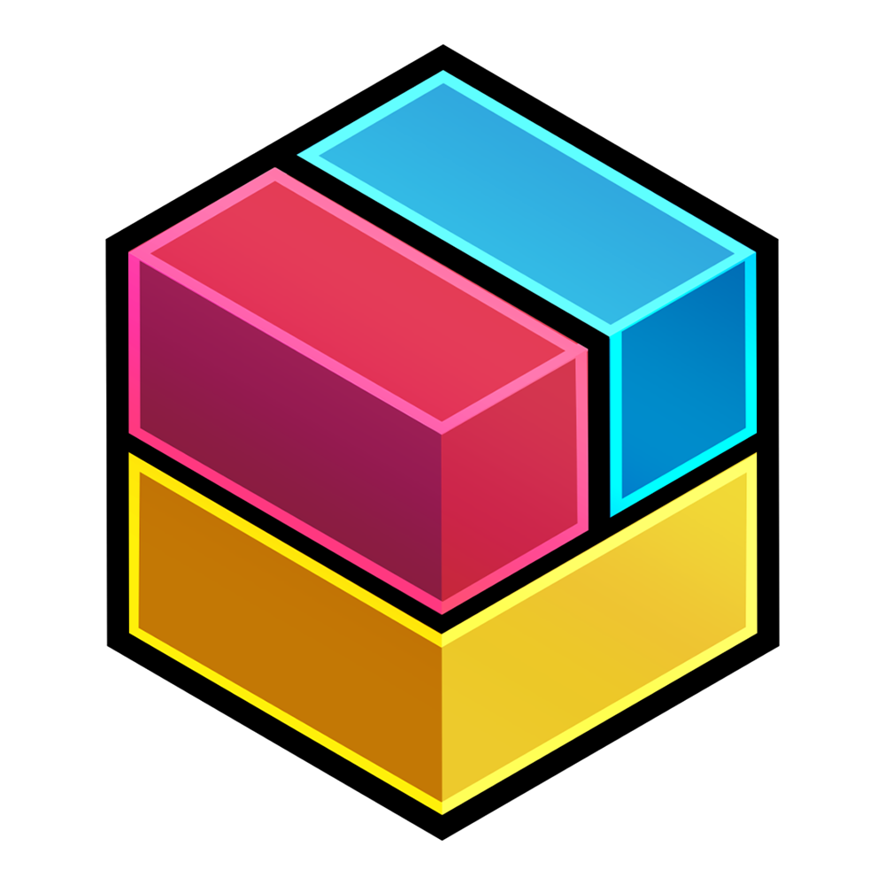

  

# Bine ai venit pe **BrickDocs**!
### Ghidul *aproape complet* pentru toți cei care își doresc să facă parte din echipa de robotică BrickBot #15996.  
Explorează toate secțiunile fiindcă fiecare este importantă pentru înțelegerea întregului proces.  
Acest site funcționează **nu doar ca un ghid**, ci și ca **o documentație** pentru principalele lucruri pe care le vom face.

---

-   :simple-first:{ .lg .middle } __FIRST Tech Challenge__

    ---

    Descoperă o comunitate mare de pasionați de robotică.

    [:octicons-arrow-right-24: Ce este FTC?](intro/about-ftc/)

-   :fontawesome-solid-cube:{ .lg .middle } __Proiectare 3D__

    ---

    Învață cum să modelezi robotul înainte de a-l construi.

    [:octicons-arrow-right-24: Proiectarea 3D](cad/cad)

-   :material-hammer-wrench:{ .lg .middle } __Mecanica__

    ---

    Construiește un robot fiabil, gata să facă față oricărei provocări.

    [:octicons-arrow-right-24: Mecanică](assembly/basic-concepts/)

-   :octicons-code-16:{ .lg .middle } __Programare__

    ---

    Scrie codul care va da viață robotului.

    [:octicons-arrow-right-24: Programare](programming/android-studio/)

-   :material-book-cog:{ .lg .middle } __Portofoliul Inginerului__

    ---

    Prezintă concis robotul, planurile echipei și activitățile de outreach ale echipei dintr-un sezon.

    [:octicons-arrow-right-24: Portofoliul Inginerului](portfolio/introduction/)

-   :fontawesome-solid-trophy:{ .lg .middle } __Procesul de Jurizare__

    ---

    Află ce caută juriul și cum să îți pui în valoare munca.

    [:octicons-arrow-right-24: Procesul de Jurizare](judging/tips/)

